<div align="center">

# ☸️ AWS EKS — Amazon Elastic Kubernetes Service

### A Complete Technical Guide: From Zero to Production-Ready Cluster

[](https://kubernetes.io)
[](https://aws.amazon.com)
[](https://docker.com)
[](https://aws.amazon.com/iam)
[](https://aws.amazon.com/vpc)
[](https://aws.amazon.com/ecr)

---

> **EKS** is a fully managed Kubernetes service by AWS that eliminates the operational overhead of running your own control plane.  
> AWS handles upgrades, patching, high availability, and scaling — you focus on your applications.

</div>

---

## 📋 Table of Contents

- [🏗️ EKS Architecture Overview](#-eks-architecture-overview)
- [⚖️ EKS vs. Self-Managed Kubernetes](#️-eks-vs-self-managed-kubernetes)
- [🔧 Chapter 1 — AWS Environment Setup](#-chapter-1--aws-environment-setup)
  - [1.1 Creating an AWS Account & IAM Users](#11-creating-an-aws-account--iam-users)
  - [1.2 Configuring the AWS CLI & kubectl](#12-configuring-the-aws-cli--kubectl)
  - [1.3 Networking & Security Groups](#13-networking--security-groups)
- [🚀 Chapter 2 — Launching Your EKS Cluster](#-chapter-2--launching-your-eks-cluster)
  - [2.1 Create via the AWS Console](#21-create-via-the-aws-console)
  - [2.2 Launch via AWS CLI](#22-launch-via-aws-cli)
  - [2.3 Authenticate with the Cluster](#23-authenticate-with-the-cluster)
- [📦 Chapter 3 — Deploying Applications](#-chapter-3--deploying-applications)
  - [3.1 Containerizing with Docker](#31-containerizing-with-docker)
  - [3.2 Kubernetes Deployment YAMLs](#32-kubernetes-deployment-yamls)
  - [3.3 Step-by-Step Deployment Guide](#33-step-by-step-deployment-guide)
- [📊 Flow & Network Diagrams](#-flow--network-diagrams)
- [🔑 Quick Reference Cheatsheet](#-quick-reference-cheatsheet)
- [🛠️ STEP-BY-STEP: Complete EKS Creation from Scratch](#️-step-by-step-complete-eks-cluster-creation-from-scratch)
  - [📦 Phase 1 — Install All Required Tools](#-phase-1--install-all-required-tools)
  - [🔑 Phase 2 — Configure AWS Identity & Permissions](#-phase-2--configure-aws-identity--permissions)
  - [🌐 Phase 3 — Build the Network (VPC)](#-phase-3--build-the-network-vpc)
  - [☸️ Phase 4 — Launch the EKS Cluster](#️-phase-4--launch-the-eks-cluster)
  - [📦 Phase 5 — Build & Push Your Container Image](#-phase-5--build--push-your-container-image)
  - [🚀 Phase 6 — Deploy Application to EKS](#-phase-6--deploy-application-to-eks)
  - [✅ Phase 7 — Final Verification Checklist](#-phase-7--final-verification-checklist)
  - [🧹 Cleanup — Delete All Resources](#-cleanup--delete-all-resources-avoid-aws-charges)

---

## 🏗️ EKS Architecture Overview

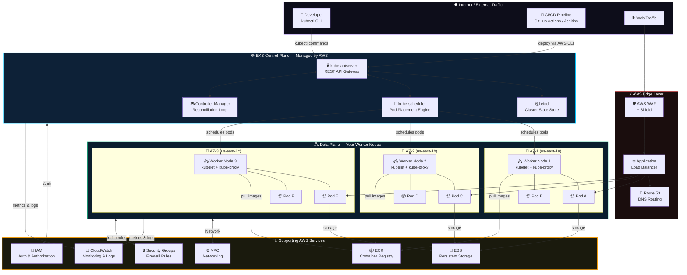

---

## ⚖️ EKS vs. Self-Managed Kubernetes

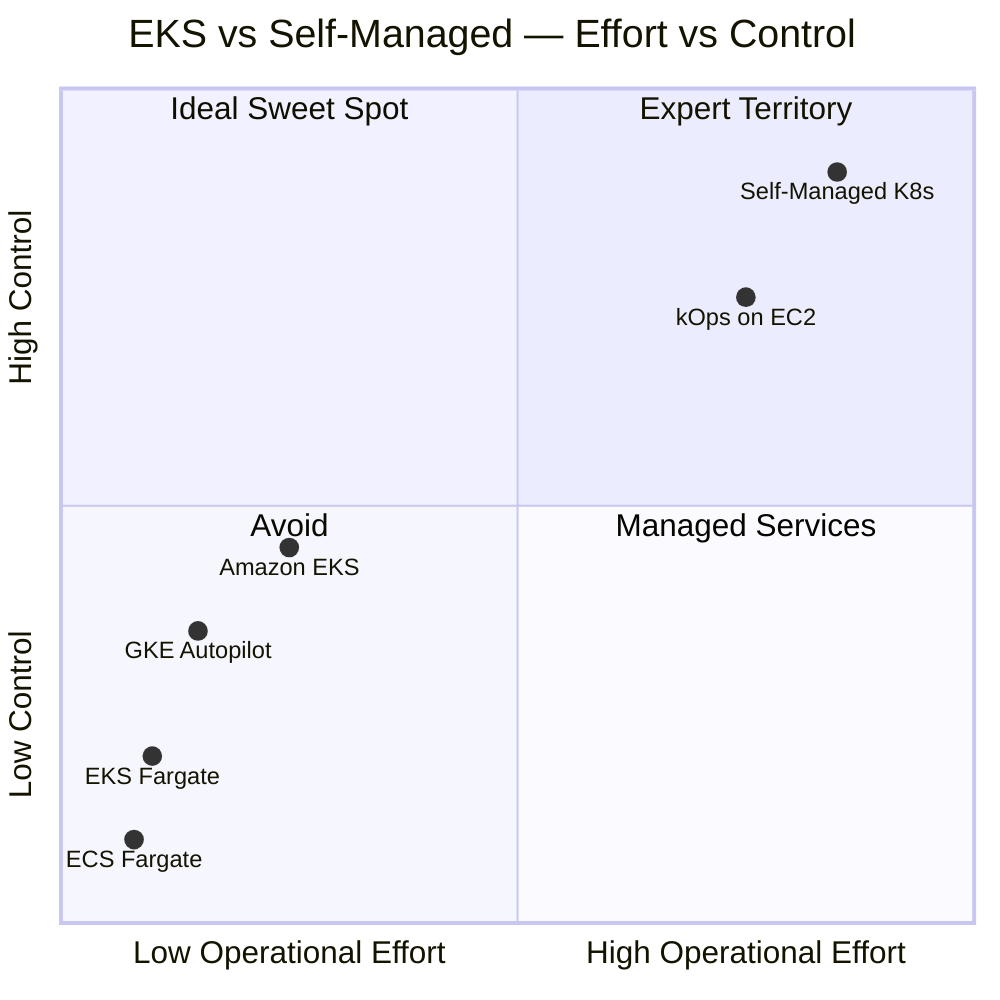

### Detailed Feature Comparison

```mermaid
flowchart LR
    subgraph EKS["☸️ Amazon EKS"]
        direction TB
        E1["✅ Managed Control Plane"]
        E2["✅ Auto Kubernetes Updates"]
        E3["✅ Multi-AZ HA by Default"]
        E4["✅ IAM Native Auth"]
        E5["✅ CloudWatch Integration"]
        E6["✅ Compliance Certified"]
        E7["❌ Higher Cost"]
        E8["❌ Less Infra Control"]
    end

    subgraph SELF["⚙️ Self-Managed"]
        direction TB
        S1["✅ Spot Instance Savings"]
        S2["✅ Full K8s Config Control"]
        S3["✅ Experimental Features"]
        S4["✅ AWS Services Compatible"]
        S5["❌ Manual Updates & Patches"]
        S6["❌ DIY High Availability"]
        S7["❌ Complex Setup"]
        S8["❌ Security Config Overhead"]
    end

    CHOOSE{"Which to Choose?"}
    TEAM["Team Expertise?"] --> CHOOSE
    BUDGET["Budget?"] --> CHOOSE
    SCALE["Scale?"] --> CHOOSE

    CHOOSE -->|"Fast Delivery<br/>Reliability Priority"| EKS
    CHOOSE -->|"Max Control<br/>Cost Optimization"| SELF

    style EKS fill:#0D2137,stroke:#00C6FF,stroke-width:2px
    style SELF fill:#1A1A0D,stroke:#94A3B8,stroke-width:2px
    style CHOOSE fill:#1A0D1A,stroke:#8B5CF6
```

---

## 🔧 Chapter 1 — AWS Environment Setup

### 1.1 Creating an AWS Account & IAM Users

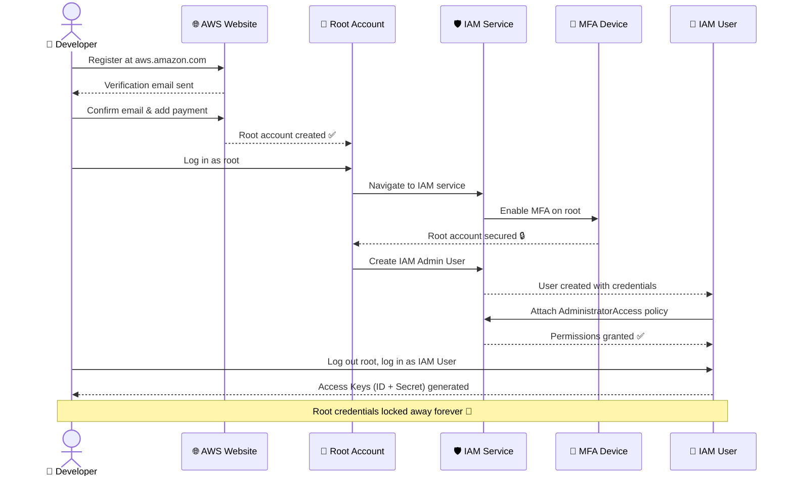

**Required IAM Policies:**

| Role | Policy Name | Purpose |
|------|------------|---------|
| EKS Cluster Role | `AmazonEKSClusterPolicy` | Control plane operations |
| EKS Cluster Role | `AmazonEKSServicePolicy` | EKS service interactions |
| Worker Node Role | `AmazonEKSWorkerNodePolicy` | Node registration to cluster |
| Worker Node Role | `AmazonEKS_CNI_Policy` | Pod networking (VPC CNI) |
| Worker Node Role | `AmazonEC2ContainerRegistryReadOnly` | Pull images from ECR |

---

### 1.2 Configuring the AWS CLI & kubectl

```mermaid
flowchart TD
    START([🚀 Start Setup]) --> INSTALL_CLI

    subgraph CLI["📥 AWS CLI Installation"]
        INSTALL_CLI["Install AWS CLI v2\ncurl + installer"]
        CONFIG_CLI["aws configure\nEnter: Key ID, Secret, Region, Format"]
        VERIFY_CLI["aws sts get-caller-identity\nVerify identity ✅"]
        INSTALL_CLI --> CONFIG_CLI --> VERIFY_CLI
    end

    subgraph KUBECTL["📥 kubectl Installation"]
        INSTALL_K8S["Download kubectl binary\ndl.k8s.io/release/stable"]
        CHMOD["chmod +x kubectl\nmv to /usr/local/bin"]
        VERIFY_K8S["kubectl version\nVerify install ✅"]
        INSTALL_K8S --> CHMOD --> VERIFY_K8S
    end

    subgraph CONNECT["🔗 Connect to EKS"]
        UPDATE_CONFIG["aws eks update-kubeconfig\n--name cluster-name --region"]
        TEST["kubectl get nodes\nVerify connection ✅"]
        UPDATE_CONFIG --> TEST
    end

    VERIFY_CLI --> INSTALL_K8S
    VERIFY_K8S --> UPDATE_CONFIG
    TEST --> DONE([✅ Tools Configured])

    style CLI fill:#0D1F35,stroke:#00C6FF
    style KUBECTL fill:#0D1F35,stroke:#10B981
    style CONNECT fill:#0D1F35,stroke:#F59E0B
```

```bash
# Step 1: Configure AWS CLI
aws configure
# AWS Access Key ID:       AKIA...
# AWS Secret Access Key:   ****
# Default region name:     us-east-1
# Default output format:   json

# Step 2: Verify identity
aws sts get-caller-identity

# Step 3: Install kubectl
curl -LO "https://dl.k8s.io/release/$(curl -L -s https://dl.k8s.io/release/stable.txt)/bin/linux/amd64/kubectl"
chmod +x kubectl && sudo mv kubectl /usr/local/bin/

# Step 4: Connect to cluster after creation
aws eks update-kubeconfig --name my-cluster --region us-east-1
kubectl get nodes
```

---

### 1.3 Networking & Security Groups

```mermaid
graph TB
    subgraph VPC["🌐 Amazon VPC — 10.0.0.0/16"]
        subgraph PUBLIC["🌍 Public Subnets — Internet-facing"]
            PUB_1A["Subnet 10.0.1.0/24\nus-east-1a\n⚖️ ALB / NAT Gateway"]
            PUB_1B["Subnet 10.0.2.0/24\nus-east-1b\n⚖️ ALB Replica"]
        end

        subgraph PRIVATE["🔒 Private Subnets — Worker Nodes"]
            PRIV_1A["Subnet 10.0.10.0/24\nus-east-1a\n🖧 Worker Nodes"]
            PRIV_1B["Subnet 10.0.20.0/24\nus-east-1b\n🖧 Worker Nodes"]
            PRIV_1C["Subnet 10.0.30.0/24\nus-east-1c\n🖧 Worker Nodes"]
        end

        IGW["🌐 Internet Gateway"]
        NAT["🔄 NAT Gateway\n(Outbound Only)"]
        SG_CP["🔒 Security Group:\nControl Plane\nPort 443 Inbound"]
        SG_WN["🔒 Security Group:\nWorker Nodes\n10250, 443 Inbound"]
    end

    INTERNET["🌐 Internet"] --> IGW
    IGW --> PUB_1A & PUB_1B
    PUB_1A --> NAT
    NAT --> PRIV_1A & PRIV_1B & PRIV_1C
    SG_CP --> PRIVATE
    SG_WN --> PRIVATE

    style VPC fill:#0A1628,stroke:#2E75B6,stroke-width:2px
    style PUBLIC fill:#0D2137,stroke:#F59E0B,stroke-width:1px
    style PRIVATE fill:#0A1E2E,stroke:#10B981,stroke-width:1px
```

**Security Group Rules:**

| Direction | Port | Protocol | Source | Purpose |
|-----------|------|----------|--------|---------|
| Inbound | 443 | HTTPS | Control Plane SG | API server comms |
| Inbound | 10250 | TCP | Control Plane SG | kubelet API |
| Inbound | 22 | SSH | Bastion Host IP | Admin access |
| Outbound | All | All | 0.0.0.0/0 | Pull images, call AWS APIs |

> ⚠️ **Tag your subnets!** EKS requires specific tags for load balancer auto-discovery:
> - Public subnets: `kubernetes.io/role/elb = 1`
> - Private subnets: `kubernetes.io/role/internal-elb = 1`

---

## 🚀 Chapter 2 — Launching Your EKS Cluster

### 2.1 Cluster Creation Flow

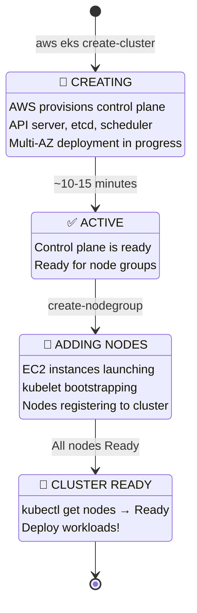

### 2.2 Launch via AWS CLI

```bash
# ── Create the EKS Cluster ──────────────────────────────────────
aws eks create-cluster \
  --name production-cluster \
  --kubernetes-version 1.28 \
  --role-arn arn:aws:iam::ACCOUNT_ID:role/EKSClusterRole \
  --resources-vpc-config \
    subnetIds=subnet-abc123,subnet-def456,subnet-ghi789,\
    securityGroupIds=sg-controlplane,\
    endpointPrivateAccess=true,\
    endpointPublicAccess=true \
  --logging '{"clusterLogging":[{"types":["api","audit","authenticator","controllerManager","scheduler"],"enabled":true}]}'

# ── Wait for cluster to be Active ──────────────────────────────
aws eks wait cluster-active --name production-cluster

# ── Create Worker Node Group ───────────────────────────────────
aws eks create-nodegroup \
  --cluster-name production-cluster \
  --nodegroup-name main-workers \
  --node-role arn:aws:iam::ACCOUNT_ID:role/EKSNodeRole \
  --subnets subnet-priv-1a subnet-priv-1b subnet-priv-1c \
  --instance-types t3.medium \
  --scaling-config minSize=2,maxSize=10,desiredSize=3 \
  --disk-size 20 \
  --ami-type AL2_x86_64
```

### 2.3 Authenticate with the Cluster

```bash
# Connect kubectl to EKS
aws eks update-kubeconfig \
  --region us-east-1 \
  --name production-cluster

# Verify nodes are Ready
kubectl get nodes -o wide

# Check cluster components
kubectl get pods -n kube-system

# View cluster details
kubectl cluster-info
```

---

## 📦 Chapter 3 — Deploying Applications

### 3.1 Containerizing with Docker

```mermaid
flowchart LR
    CODE["💻 Application\nSource Code"] -->|Dockerfile| BUILD

    subgraph BUILD["🐳 Docker Build Process"]
        direction TB
        STAGE1["Stage 1: Builder\nFROM node:18-alpine\nInstall dependencies\nnpm ci --only=production"]
        STAGE2["Stage 2: Runtime\nFROM node:18-alpine\nCopy from builder\nMinimal final image"]
        STAGE1 --> STAGE2
    end

    BUILD -->|docker push| ECR

    subgraph ECR["📦 Amazon ECR"]
        direction TB
        IMG1["my-app:latest"]
        IMG2["my-app:v1.0.0"]
        IMG3["my-app:v1.0.1"]
    end

    ECR -->|image pull| K8S

    subgraph K8S["☸️ EKS Cluster"]
        direction TB
        POD1["📦 Pod 1\ncontainer running"]
        POD2["📦 Pod 2\ncontainer running"]
        POD3["📦 Pod 3\ncontainer running"]
    end

    style BUILD fill:#0D2137,stroke:#2496ED
    style ECR fill:#1A1A0D,stroke:#FF9900
    style K8S fill:#0A1E2E,stroke:#326CE5
```

**Production Dockerfile:**

```dockerfile
# ── Stage 1: Build ──────────────────────────────────────
FROM node:18-alpine AS builder
WORKDIR /app
COPY package*.json ./
RUN npm ci --only=production

# ── Stage 2: Runtime (minimal image) ─────────────────────
FROM node:18-alpine
WORKDIR /app
COPY --from=builder /app/node_modules ./node_modules
COPY . .
EXPOSE 3000
CMD ["node", "server.js"]
```

```bash
# Authenticate Docker to ECR
aws ecr get-login-password --region us-east-1 | \
  docker login --username AWS \
  --password-stdin ACCOUNT.dkr.ecr.us-east-1.amazonaws.com

# Build, tag and push
docker build -t my-app:latest .
docker tag my-app:latest ACCOUNT.dkr.ecr.us-east-1.amazonaws.com/my-app:latest
docker push ACCOUNT.dkr.ecr.us-east-1.amazonaws.com/my-app:latest
```

---

### 3.2 Kubernetes Deployment YAMLs

```mermaid
graph LR
    subgraph K8S_OBJECTS["☸️ Kubernetes Objects"]
        DEP["📋 Deployment\nManages ReplicaSet\nRolling Updates\nSelf-healing"]
        RS["🔁 ReplicaSet\nEnsures 3 Pods\nAlways Running"]
        SVC["🌐 Service\nLoad Balancing\nDNS Resolution\nPort Mapping"]
        HPA["📈 HPA\nAuto-scales pods\nbased on CPU/Memory"]
        POD1["📦 Pod 1"] 
        POD2["📦 Pod 2"] 
        POD3["📦 Pod 3"]
    end

    subgraph AWS_INFRA["☁️ AWS Infrastructure"]
        ALB["⚖️ AWS ALB\nExternal Traffic"]
        ECR_IMG["📦 ECR Image"]
        CW_LOG["📊 CloudWatch\nLogs & Metrics"]
    end

    DEP --> RS
    DEP --> HPA
    RS --> POD1 & POD2 & POD3
    SVC --> POD1 & POD2 & POD3
    ALB --> SVC
    ECR_IMG --> POD1 & POD2 & POD3
    POD1 & POD2 & POD3 --> CW_LOG

    style K8S_OBJECTS fill:#0A1628,stroke:#326CE5,stroke-width:2px
    style AWS_INFRA fill:#1A1A0D,stroke:#FF9900,stroke-width:2px
```

**deployment.yaml:**

```yaml
apiVersion: apps/v1
kind: Deployment
metadata:
  name: my-application
  labels:
    app: my-application
    version: v1.0.0
spec:
  replicas: 3
  selector:
    matchLabels:
      app: my-application
  strategy:
    type: RollingUpdate
    rollingUpdate:
      maxSurge: 1
      maxUnavailable: 0        # Zero-downtime deployments
  template:
    metadata:
      labels:
        app: my-application
    spec:
      containers:
      - name: my-application
        image: ACCOUNT.dkr.ecr.us-east-1.amazonaws.com/my-app:latest
        ports:
        - containerPort: 3000
        resources:             # ALWAYS define these!
          requests:
            cpu: "250m"
            memory: "128Mi"
          limits:
            cpu: "500m"
            memory: "256Mi"
        readinessProbe:        # Pod only receives traffic when ready
          httpGet:
            path: /health
            port: 3000
          initialDelaySeconds: 10
          periodSeconds: 5
        livenessProbe:         # Restart unhealthy pods automatically
          httpGet:
            path: /health
            port: 3000
          initialDelaySeconds: 30
          periodSeconds: 10
---
apiVersion: v1
kind: Service
metadata:
  name: my-app-service
spec:
  type: LoadBalancer           # Provisions AWS ALB automatically
  selector:
    app: my-application
  ports:
  - protocol: TCP
    port: 80
    targetPort: 3000
---
apiVersion: autoscaling/v2
kind: HorizontalPodAutoscaler
metadata:
  name: my-app-hpa
spec:
  scaleTargetRef:
    apiVersion: apps/v1
    kind: Deployment
    name: my-application
  minReplicas: 3
  maxReplicas: 20
  metrics:
  - type: Resource
    resource:
      name: cpu
      target:
        type: Utilization
        averageUtilization: 70
```

---

### 3.3 Step-by-Step Deployment Guide

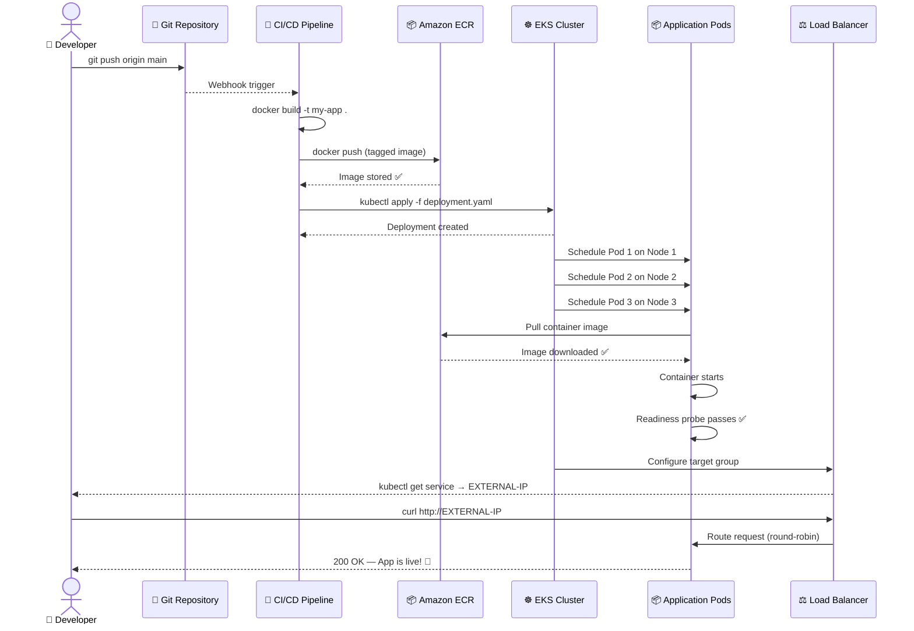

**Complete deployment commands:**

```bash
# ── 1. Apply manifests ──────────────────────────────────────
kubectl apply -f deployment.yaml

# ── 2. Watch rollout progress ───────────────────────────────
kubectl rollout status deployment/my-application

# ── 3. Verify pods are running ──────────────────────────────
kubectl get pods -l app=my-application

# ── 4. Get LoadBalancer endpoint ────────────────────────────
kubectl get service my-app-service
# NAME              TYPE           CLUSTER-IP     EXTERNAL-IP
# my-app-service    LoadBalancer   10.100.0.123   abc.us-east-1.elb.amazonaws.com

# ── 5. Stream live logs ─────────────────────────────────────
kubectl logs -l app=my-application --tail=100 -f

# ── 6. Scale manually if needed ─────────────────────────────
kubectl scale deployment/my-application --replicas=5

# ── 7. Rollback if something goes wrong ─────────────────────
kubectl rollout undo deployment/my-application
```

---

## 📊 Flow & Network Diagrams

### Request Flow — Internet to Pod

```mermaid
flowchart LR
    USER["👤 User\nBrowser / App"] -->|"HTTPS :443"| R53
    R53["🔵 Route 53\nabc.example.com"] -->|"DNS A Record"| ALB
    ALB["⚖️ ALB\nssl-termination"] -->|"HTTP :80"| TG
    TG["🎯 Target Group\nRegistered Pods"] -->|"Port 3000"| SVC
    SVC["🌐 K8s Service\nClusterIP"] -->|"Round Robin"| POD

    subgraph POD["📦 Application Pod"]
        CONT["Node.js Container\nPort 3000"]
    end

    style USER fill:#1A0D1A,stroke:#8B5CF6
    style ALB fill:#1A0D0D,stroke:#EF4444
    style SVC fill:#0D2137,stroke:#00C6FF
    style POD fill:#0A1E2E,stroke:#10B981
```

### Cluster Autoscaling Flow

```mermaid
flowchart TD
    TRAFFIC["📈 Traffic Spike"] --> HPA
    HPA["📊 HPA\nDetects CPU > 70%"] -->|"Scale pods"| DEPLOY
    DEPLOY["📋 Deployment\nRequests more pods"] -->|"Pending pods"| CA
    CA["⚙️ Cluster Autoscaler\nor Karpenter"] -->|"Provision nodes"| ASG
    ASG["🖧 Auto Scaling Group\nLaunches EC2 instances"] -->|"Nodes join cluster"| NODES
    NODES["✅ New Worker Nodes\nReady state"] -->|"Pods scheduled"| PODS
    PODS["📦 New Pods\nRunning"] -->|"Traffic served"| DONE["✅ Load Handled"]

    style HPA fill:#0D2137,stroke:#00C6FF
    style CA fill:#0A1E2E,stroke:#10B981
    style ASG fill:#1A1A0D,stroke:#F59E0B
```

---

## 🔑 Quick Reference Cheatsheet

### Essential kubectl Commands

```bash
# ─── Cluster Info ─────────────────────────────────────────────
kubectl cluster-info                          # Cluster endpoint info
kubectl get nodes -o wide                     # All nodes + IPs
kubectl describe node <node-name>             # Node details

# ─── Pods ─────────────────────────────────────────────────────
kubectl get pods -A                           # All pods, all namespaces
kubectl get pods -l app=my-app                # Filter by label
kubectl describe pod <pod-name>               # Pod details + events
kubectl logs <pod-name> -f                    # Stream logs
kubectl exec -it <pod-name> -- /bin/sh        # Shell into pod

# ─── Deployments ──────────────────────────────────────────────
kubectl get deployments                       # List deployments
kubectl rollout status deployment/<name>      # Check rollout
kubectl rollout history deployment/<name>     # View history
kubectl rollout undo deployment/<name>        # Rollback
kubectl scale deployment/<name> --replicas=5  # Scale

# ─── Services ─────────────────────────────────────────────────
kubectl get services                          # List services
kubectl get service <name> -o yaml            # Full service spec

# ─── Debugging ────────────────────────────────────────────────
kubectl get events --sort-by='.lastTimestamp' # Recent events
kubectl top nodes                             # CPU/Memory by node
kubectl top pods                              # CPU/Memory by pod
```

### AWS EKS Commands

```bash
# ─── Cluster Management ───────────────────────────────────────
aws eks list-clusters                         # List all clusters
aws eks describe-cluster --name my-cluster    # Cluster details
aws eks update-kubeconfig --name my-cluster   # Connect kubectl

# ─── Node Groups ──────────────────────────────────────────────
aws eks list-nodegroups --cluster-name my-cluster
aws eks describe-nodegroup --cluster-name my-cluster --nodegroup-name workers
aws eks update-nodegroup-config \             # Scale node group
  --cluster-name my-cluster \
  --nodegroup-name workers \
  --scaling-config minSize=3,maxSize=15,desiredSize=5

# ─── Upgrades ─────────────────────────────────────────────────
aws eks update-cluster-version \              # Upgrade K8s version
  --name my-cluster --kubernetes-version 1.29
```

---

# 🛠️ STEP-BY-STEP: Complete EKS Cluster Creation from Scratch

> **This section is a standalone hands-on walkthrough.** Follow every step in order — from a blank AWS account to a live, application-serving EKS cluster. Each step includes the exact command, what it does, and how to verify it worked.

---

## 🗺️ Your Journey at a Glance

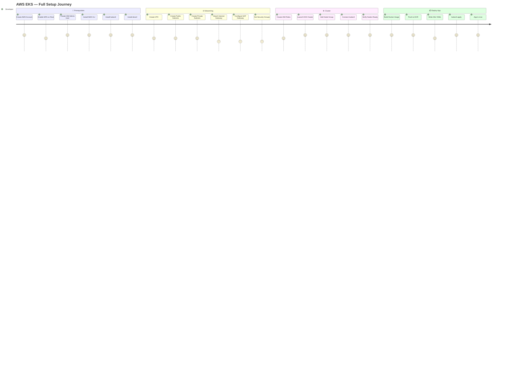

---

## 📦 PHASE 1 — Install All Required Tools

> ⏱️ **Estimated time: 15 minutes**

---

### STEP 1 — Install the AWS CLI v2

**What it does:** Lets you control all AWS services from your terminal.

```bash
# ── macOS ──────────────────────────────────────────────────────
curl "https://awscli.amazonaws.com/AWSCLIV2.pkg" -o "AWSCLIV2.pkg"
sudo installer -pkg AWSCLIV2.pkg -target /

# ── Linux (Ubuntu/Debian) ──────────────────────────────────────
curl "https://awscli.amazonaws.com/awscli-exe-linux-x86_64.zip" -o "awscliv2.zip"
unzip awscliv2.zip
sudo ./aws/install

# ── Windows (PowerShell) ──────────────────────────────────────
msiexec.exe /i https://awscli.amazonaws.com/AWSCLIV2.msi

# ✅ Verify installation
aws --version
# Expected: aws-cli/2.x.x Python/3.x ...
```

---

### STEP 2 — Install kubectl

**What it does:** The CLI for communicating with your Kubernetes cluster API.

```bash
# ── Linux ──────────────────────────────────────────────────────
curl -LO "https://dl.k8s.io/release/$(curl -L -s \
  https://dl.k8s.io/release/stable.txt)/bin/linux/amd64/kubectl"
chmod +x kubectl
sudo mv kubectl /usr/local/bin/

# ── macOS (Homebrew) ───────────────────────────────────────────
brew install kubectl

# ── Windows (Chocolatey) ──────────────────────────────────────
choco install kubernetes-cli

# ✅ Verify installation
kubectl version --client
# Expected: Client Version: v1.28.x
```

---

### STEP 3 — Install eksctl (Recommended)

**What it does:** The official CLI tool for EKS — simplifies cluster creation to one command.

```bash
# ── Linux / macOS ─────────────────────────────────────────────
curl --silent --location \
  "https://github.com/weaveworks/eksctl/releases/latest/download/eksctl_$(uname -s)_amd64.tar.gz" \
  | tar xz -C /tmp
sudo mv /tmp/eksctl /usr/local/bin

# ── macOS (Homebrew) ───────────────────────────────────────────
brew tap weaveworks/tap
brew install weaveworks/tap/eksctl

# ✅ Verify installation
eksctl version
# Expected: 0.x.x
```

---

## 🔑 PHASE 2 — Configure AWS Identity & Permissions

> ⏱️ **Estimated time: 20 minutes**

---

### STEP 4 — Create Your AWS Account & Lock Root

```mermaid
flowchart LR
    A["🌐 aws.amazon.com\nClick Sign Up"] --> B["📧 Enter Email\n& Password"]
    B --> C["💳 Add Payment\nMethod"]
    C --> D["✅ Root Account\nCreated"]
    D --> E["📱 Enable MFA\non Root Account"]
    E --> F["🔒 Root Account\nSecured — Lock it away!"]
    F --> G["👤 Create IAM\nAdmin User"]
    G --> H["🎉 Use IAM User\nfor all future work"]

    style D fill:#0A2E1A,stroke:#10B981
    style F fill:#2E0A0A,stroke:#EF4444
    style H fill:#0A1E2E,stroke:#326CE5
```

> 🔒 **Rule #1:** After creating your IAM admin user, **never log in as root again** except for billing changes.

---

### STEP 5 — Configure AWS CLI with Your Credentials

```bash
# Run the interactive configuration wizard
aws configure

# You will be prompted for:
# AWS Access Key ID:      → Paste your Access Key ID from IAM
# AWS Secret Access Key:  → Paste your Secret Key from IAM
# Default region name:    → us-east-1  (or your preferred region)
# Default output format:  → json

# ✅ Verify your identity is correct
aws sts get-caller-identity
```

**Expected output:**
```json
{
    "UserId": "AIDAXXXXXXXXXXXXXXXXX",
    "Account": "123456789012",
    "Arn": "arn:aws:iam::123456789012:user/eks-admin"
}
```

---

### STEP 6 — Create IAM Roles for EKS

**What it does:** EKS needs 2 IAM roles — one for the control plane, one for worker nodes.

```bash
# ── Create EKS Cluster Service Role ───────────────────────────
aws iam create-role \
  --role-name EKSClusterRole \
  --assume-role-policy-document '{
    "Version": "2012-10-17",
    "Statement": [{
      "Effect": "Allow",
      "Principal": { "Service": "eks.amazonaws.com" },
      "Action": "sts:AssumeRole"
    }]
  }'

# Attach required policies to cluster role
aws iam attach-role-policy \
  --role-name EKSClusterRole \
  --policy-arn arn:aws:iam::aws:policy/AmazonEKSClusterPolicy

# ── Create Worker Node Role ────────────────────────────────────
aws iam create-role \
  --role-name EKSNodeRole \
  --assume-role-policy-document '{
    "Version": "2012-10-17",
    "Statement": [{
      "Effect": "Allow",
      "Principal": { "Service": "ec2.amazonaws.com" },
      "Action": "sts:AssumeRole"
    }]
  }'

# Attach all 3 required policies to worker node role
aws iam attach-role-policy --role-name EKSNodeRole \
  --policy-arn arn:aws:iam::aws:policy/AmazonEKSWorkerNodePolicy

aws iam attach-role-policy --role-name EKSNodeRole \
  --policy-arn arn:aws:iam::aws:policy/AmazonEKS_CNI_Policy

aws iam attach-role-policy --role-name EKSNodeRole \
  --policy-arn arn:aws:iam::aws:policy/AmazonEC2ContainerRegistryReadOnly

# ✅ Verify roles exist
aws iam get-role --role-name EKSClusterRole --query 'Role.RoleName'
aws iam get-role --role-name EKSNodeRole    --query 'Role.RoleName'
```

| Role | Policies Required | Used By |
|------|------------------|---------|
| `EKSClusterRole` | `AmazonEKSClusterPolicy` | EKS control plane |
| `EKSNodeRole` | `AmazonEKSWorkerNodePolicy` | Worker EC2 instances |
| `EKSNodeRole` | `AmazonEKS_CNI_Policy` | Pod networking (VPC CNI) |
| `EKSNodeRole` | `AmazonEC2ContainerRegistryReadOnly` | Pulling images from ECR |

---

## 🌐 PHASE 3 — Build the Network (VPC)

> ⏱️ **Estimated time: 25 minutes**

---

### STEP 7 — Create VPC & Subnets

**What it does:** Creates an isolated network where your EKS cluster will live.

```mermaid
graph TB
    subgraph VPC["🌐 Your VPC — 10.0.0.0/16"]
        direction TB

        subgraph PUB["🌍 Public Tier — Load Balancers & NAT"]
            PS1["Public Subnet A\n10.0.1.0/24\nus-east-1a"]
            PS2["Public Subnet B\n10.0.2.0/24\nus-east-1b"]
        end

        subgraph PRIV["🔒 Private Tier — Worker Nodes"]
            NS1["Private Subnet A\n10.0.10.0/24\nus-east-1a"]
            NS2["Private Subnet B\n10.0.20.0/24\nus-east-1b"]
            NS3["Private Subnet C\n10.0.30.0/24\nus-east-1c"]
        end

        IGW["🌐 Internet Gateway\n(Public Traffic In/Out)"]
        NAT["🔄 NAT Gateway\n(Private Outbound Only)"]
        RT_PUB["📋 Public Route Table\n0.0.0.0/0 → IGW"]
        RT_PRIV["📋 Private Route Table\n0.0.0.0/0 → NAT"]

        IGW --> RT_PUB --> PUB
        NAT --> RT_PRIV --> PRIV
        PUB --> NAT
    end

    INTERNET["🌐 Internet"] --> IGW

    style PUB fill:#1A1A0D,stroke:#F59E0B,stroke-width:2px
    style PRIV fill:#0A1E2E,stroke:#10B981,stroke-width:2px
    style VPC fill:#080F1A,stroke:#2E75B6,stroke-width:3px
```

```bash
# ── Step 7a: Create the VPC ────────────────────────────────────
VPC_ID=$(aws ec2 create-vpc \
  --cidr-block 10.0.0.0/16 \
  --query 'Vpc.VpcId' --output text)
echo "VPC ID: $VPC_ID"

aws ec2 create-tags --resources $VPC_ID \
  --tags Key=Name,Value=eks-vpc

# Enable DNS for the VPC (required by EKS)
aws ec2 modify-vpc-attribute --vpc-id $VPC_ID --enable-dns-support
aws ec2 modify-vpc-attribute --vpc-id $VPC_ID --enable-dns-hostnames

# ── Step 7b: Create Public Subnets ────────────────────────────
PUB_SUBNET_1=$(aws ec2 create-subnet \
  --vpc-id $VPC_ID --cidr-block 10.0.1.0/24 \
  --availability-zone us-east-1a \
  --query 'Subnet.SubnetId' --output text)

PUB_SUBNET_2=$(aws ec2 create-subnet \
  --vpc-id $VPC_ID --cidr-block 10.0.2.0/24 \
  --availability-zone us-east-1b \
  --query 'Subnet.SubnetId' --output text)

# Tag public subnets — EKS needs this for ALB auto-discovery
aws ec2 create-tags --resources $PUB_SUBNET_1 $PUB_SUBNET_2 \
  --tags Key=kubernetes.io/role/elb,Value=1

# ── Step 7c: Create Private Subnets ───────────────────────────
PRIV_SUBNET_1=$(aws ec2 create-subnet \
  --vpc-id $VPC_ID --cidr-block 10.0.10.0/24 \
  --availability-zone us-east-1a \
  --query 'Subnet.SubnetId' --output text)

PRIV_SUBNET_2=$(aws ec2 create-subnet \
  --vpc-id $VPC_ID --cidr-block 10.0.20.0/24 \
  --availability-zone us-east-1b \
  --query 'Subnet.SubnetId' --output text)

PRIV_SUBNET_3=$(aws ec2 create-subnet \
  --vpc-id $VPC_ID --cidr-block 10.0.30.0/24 \
  --availability-zone us-east-1c \
  --query 'Subnet.SubnetId' --output text)

# Tag private subnets — for internal load balancers
aws ec2 create-tags \
  --resources $PRIV_SUBNET_1 $PRIV_SUBNET_2 $PRIV_SUBNET_3 \
  --tags Key=kubernetes.io/role/internal-elb,Value=1

# ✅ Verify subnets
aws ec2 describe-subnets \
  --filters Name=vpc-id,Values=$VPC_ID \
  --query 'Subnets[*].[SubnetId,CidrBlock,AvailabilityZone]' \
  --output table
```

---

### STEP 8 — Create Internet Gateway & NAT Gateway

```bash
# ── Step 8a: Internet Gateway (for public subnets) ────────────
IGW_ID=$(aws ec2 create-internet-gateway \
  --query 'InternetGateway.InternetGatewayId' --output text)

aws ec2 attach-internet-gateway \
  --internet-gateway-id $IGW_ID \
  --vpc-id $VPC_ID

# ── Step 8b: Elastic IP for NAT Gateway ───────────────────────
EIP_ALLOC=$(aws ec2 allocate-address \
  --domain vpc \
  --query 'AllocationId' --output text)

# ── Step 8c: NAT Gateway (for private subnet outbound) ────────
NAT_GW=$(aws ec2 create-nat-gateway \
  --subnet-id $PUB_SUBNET_1 \
  --allocation-id $EIP_ALLOC \
  --query 'NatGateway.NatGatewayId' --output text)

echo "Waiting for NAT Gateway to become available (~60 seconds)..."
aws ec2 wait nat-gateway-available --nat-gateway-ids $NAT_GW
echo "✅ NAT Gateway ready!"

# ── Step 8d: Create & Associate Route Tables ──────────────────
# Public route table → IGW
PUB_RT=$(aws ec2 create-route-table \
  --vpc-id $VPC_ID \
  --query 'RouteTable.RouteTableId' --output text)

aws ec2 create-route --route-table-id $PUB_RT \
  --destination-cidr-block 0.0.0.0/0 \
  --gateway-id $IGW_ID

aws ec2 associate-route-table --route-table-id $PUB_RT \
  --subnet-id $PUB_SUBNET_1
aws ec2 associate-route-table --route-table-id $PUB_RT \
  --subnet-id $PUB_SUBNET_2

# Private route table → NAT
PRIV_RT=$(aws ec2 create-route-table \
  --vpc-id $VPC_ID \
  --query 'RouteTable.RouteTableId' --output text)

aws ec2 create-route --route-table-id $PRIV_RT \
  --destination-cidr-block 0.0.0.0/0 \
  --nat-gateway-id $NAT_GW

aws ec2 associate-route-table --route-table-id $PRIV_RT \
  --subnet-id $PRIV_SUBNET_1
aws ec2 associate-route-table --route-table-id $PRIV_RT \
  --subnet-id $PRIV_SUBNET_2
aws ec2 associate-route-table --route-table-id $PRIV_RT \
  --subnet-id $PRIV_SUBNET_3
```

---

### STEP 9 — Create Security Groups

```bash
# ── Control Plane Security Group ──────────────────────────────
CP_SG=$(aws ec2 create-security-group \
  --group-name eks-controlplane-sg \
  --description "EKS Control Plane Security Group" \
  --vpc-id $VPC_ID \
  --query 'GroupId' --output text)

# ── Worker Node Security Group ─────────────────────────────────
NODE_SG=$(aws ec2 create-security-group \
  --group-name eks-nodes-sg \
  --description "EKS Worker Nodes Security Group" \
  --vpc-id $VPC_ID \
  --query 'GroupId' --output text)

# Allow worker nodes to talk to control plane (port 443)
aws ec2 authorize-security-group-ingress \
  --group-id $CP_SG --protocol tcp \
  --port 443 --source-group $NODE_SG

# Allow control plane to talk to worker nodes (port 10250 — kubelet)
aws ec2 authorize-security-group-ingress \
  --group-id $NODE_SG --protocol tcp \
  --port 10250 --source-group $CP_SG

# Allow nodes to communicate with each other
aws ec2 authorize-security-group-ingress \
  --group-id $NODE_SG --protocol -1 \
  --port -1 --source-group $NODE_SG

# Allow all outbound (nodes need to pull images, call AWS APIs)
aws ec2 authorize-security-group-egress \
  --group-id $NODE_SG --protocol -1 \
  --port -1 --cidr 0.0.0.0/0

echo "✅ Security Groups ready!"
echo "  Control Plane SG: $CP_SG"
echo "  Worker Node SG:   $NODE_SG"
```

---

## ☸️ PHASE 4 — Launch the EKS Cluster

> ⏱️ **Estimated time: 20 minutes (mostly waiting)**

---

### STEP 10 — Create the EKS Cluster

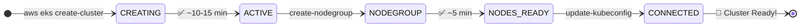

```bash
# ── Option A: Using eksctl (Easiest) ──────────────────────────
eksctl create cluster \
  --name production-cluster \
  --region us-east-1 \
  --version 1.28 \
  --nodegroup-name main-workers \
  --node-type t3.medium \
  --nodes 3 \
  --nodes-min 2 \
  --nodes-max 10 \
  --managed
# eksctl handles VPC, subnets, IAM roles automatically!

# ─────────────────────────────────────────────────────────────
# ── Option B: Manual via AWS CLI (Full Control) ───────────────
# Get your account ID first
ACCOUNT_ID=$(aws sts get-caller-identity --query Account --output text)

aws eks create-cluster \
  --name production-cluster \
  --kubernetes-version 1.28 \
  --role-arn arn:aws:iam::${ACCOUNT_ID}:role/EKSClusterRole \
  --resources-vpc-config \
    subnetIds=${PRIV_SUBNET_1},${PRIV_SUBNET_2},${PRIV_SUBNET_3},\
${PUB_SUBNET_1},${PUB_SUBNET_2},\
    securityGroupIds=${CP_SG},\
    endpointPrivateAccess=true,\
    endpointPublicAccess=true \
  --logging \
    '{"clusterLogging":[{"types":["api","audit","authenticator"],"enabled":true}]}'

# ⏳ Wait for cluster to become ACTIVE
echo "Waiting for cluster to become active (10-15 min)..."
aws eks wait cluster-active --name production-cluster
echo "✅ Cluster is ACTIVE!"

# ✅ Verify cluster status
aws eks describe-cluster \
  --name production-cluster \
  --query 'cluster.status'
```

---

### STEP 11 — Add Worker Node Group

```bash
aws eks create-nodegroup \
  --cluster-name production-cluster \
  --nodegroup-name main-workers \
  --node-role arn:aws:iam::${ACCOUNT_ID}:role/EKSNodeRole \
  --subnets ${PRIV_SUBNET_1} ${PRIV_SUBNET_2} ${PRIV_SUBNET_3} \
  --instance-types t3.medium \
  --ami-type AL2_x86_64 \
  --scaling-config minSize=2,maxSize=10,desiredSize=3 \
  --disk-size 20 \
  --labels role=worker,env=production

# ⏳ Wait for nodes to be Ready
aws eks wait nodegroup-active \
  --cluster-name production-cluster \
  --nodegroup-name main-workers
echo "✅ Node group is ACTIVE!"
```

---

### STEP 12 — Connect kubectl to Your Cluster

```bash
# Update your local kubeconfig file
aws eks update-kubeconfig \
  --region us-east-1 \
  --name production-cluster

# ✅ Verify all nodes are in Ready state
kubectl get nodes -o wide

# Expected output:
# NAME                         STATUS   ROLES    AGE   VERSION
# ip-10-0-10-xx.ec2.internal   Ready    <none>   2m    v1.28.x
# ip-10-0-20-xx.ec2.internal   Ready    <none>   2m    v1.28.x
# ip-10-0-30-xx.ec2.internal   Ready    <none>   2m    v1.28.x

# Verify system pods are running
kubectl get pods -n kube-system

# View cluster details
kubectl cluster-info
```

> 🎉 **Your EKS cluster is live!** You now have a fully operational Kubernetes cluster running on AWS.

---

## 📦 PHASE 5 — Build & Push Your Container Image

> ⏱️ **Estimated time: 15 minutes**

---

### STEP 13 — Create an ECR Repository

```bash
# Create private container registry
aws ecr create-repository \
  --repository-name my-application \
  --region us-east-1 \
  --image-scanning-configuration scanOnPush=true \
  --encryption-configuration encryptionType=AES256

# ✅ Get repository URI
ECR_URI=$(aws ecr describe-repositories \
  --repository-names my-application \
  --query 'repositories[0].repositoryUri' \
  --output text)
echo "ECR URI: $ECR_URI"
```

---

### STEP 14 — Build, Tag & Push Docker Image

```bash
# ── Authenticate Docker to ECR ────────────────────────────────
aws ecr get-login-password --region us-east-1 | \
  docker login \
  --username AWS \
  --password-stdin ${ACCOUNT_ID}.dkr.ecr.us-east-1.amazonaws.com

# ── Build the Docker image ────────────────────────────────────
docker build -t my-application:latest .

# ── Tag for ECR ───────────────────────────────────────────────
docker tag my-application:latest ${ECR_URI}:latest
docker tag my-application:latest ${ECR_URI}:v1.0.0

# ── Push to ECR ───────────────────────────────────────────────
docker push ${ECR_URI}:latest
docker push ${ECR_URI}:v1.0.0

# ✅ Verify image exists in ECR
aws ecr list-images \
  --repository-name my-application \
  --query 'imageIds[*].imageTag' \
  --output table
```

---

## 🚀 PHASE 6 — Deploy Application to EKS

> ⏱️ **Estimated time: 10 minutes**

---

### STEP 15 — Create Kubernetes Namespace

```bash
# Create a dedicated namespace for your app (best practice)
kubectl create namespace production

# Set it as the default namespace for this session
kubectl config set-context --current --namespace=production

# ✅ Verify namespace
kubectl get namespaces
```

---

### STEP 16 — Apply Deployment & Service Manifests

```bash
# Save this as deployment.yaml, then apply it:
kubectl apply -f - <<EOF
apiVersion: apps/v1
kind: Deployment
metadata:
  name: my-application
  namespace: production
spec:
  replicas: 3
  selector:
    matchLabels:
      app: my-application
  template:
    metadata:
      labels:
        app: my-application
    spec:
      containers:
      - name: app
        image: ${ECR_URI}:latest
        ports:
        - containerPort: 3000
        resources:
          requests: { cpu: "250m", memory: "128Mi" }
          limits:   { cpu: "500m", memory: "256Mi" }
        readinessProbe:
          httpGet: { path: /health, port: 3000 }
          initialDelaySeconds: 10
---
apiVersion: v1
kind: Service
metadata:
  name: my-app-service
  namespace: production
spec:
  type: LoadBalancer
  selector:
    app: my-application
  ports:
  - port: 80
    targetPort: 3000
EOF
```

---

### STEP 17 — Monitor & Verify the Deployment

```bash
# ── Watch pods come up ────────────────────────────────────────
kubectl get pods -n production -w
# Wait until all pods show STATUS=Running and READY=1/1

# ── Check deployment rollout ──────────────────────────────────
kubectl rollout status deployment/my-application -n production
# Expected: deployment "my-application" successfully rolled out

# ── Get the LoadBalancer endpoint ─────────────────────────────
kubectl get service my-app-service -n production
# Wait ~2 min for EXTERNAL-IP to be assigned by AWS

# ── Test the application is live ──────────────────────────────
ENDPOINT=$(kubectl get svc my-app-service -n production \
  -o jsonpath='{.status.loadBalancer.ingress[0].hostname}')
curl http://${ENDPOINT}
# Expected: Your app's HTTP response 🎉

# ── Stream live logs ──────────────────────────────────────────
kubectl logs -l app=my-application -n production --tail=50 -f
```

---

### STEP 18 — Enable Auto-Scaling (Optional but Recommended)

```bash
# Apply Horizontal Pod Autoscaler
kubectl apply -f - <<EOF
apiVersion: autoscaling/v2
kind: HorizontalPodAutoscaler
metadata:
  name: my-app-hpa
  namespace: production
spec:
  scaleTargetRef:
    apiVersion: apps/v1
    kind: Deployment
    name: my-application
  minReplicas: 3
  maxReplicas: 20
  metrics:
  - type: Resource
    resource:
      name: cpu
      target:
        type: Utilization
        averageUtilization: 70
EOF

# ✅ Verify HPA is configured
kubectl get hpa -n production
# Expected: TARGETS shows CPU%, MINPODS=3, MAXPODS=20
```

---

## ✅ PHASE 7 — Final Verification Checklist

```mermaid
flowchart TD
    subgraph CHECK["🔍 Deployment Health Checklist"]
        C1{"kubectl get nodes\nAll nodes Ready?"}
        C2{"kubectl get pods -A\nAll pods Running?"}
        C3{"kubectl get svc\nEXTERNAL-IP assigned?"}
        C4{"curl EXTERNAL-IP\nApp returns 200 OK?"}
        C5{"kubectl top nodes\nCPU/Memory visible?"}
        C6{"CloudWatch Logs\nLogs streaming?"}

        C1 -->|✅ Yes| C2
        C1 -->|❌ No| FIX1["Check node group status\naws eks describe-nodegroup"]
        C2 -->|✅ Yes| C3
        C2 -->|❌ No| FIX2["kubectl describe pod\nCheck Events section"]
        C3 -->|✅ Yes| C4
        C3 -->|❌ No| FIX3["Wait 2-3 min\nAWS provisioning ALB"]
        C4 -->|✅ Yes| C5
        C4 -->|❌ No| FIX4["kubectl logs <pod>\nCheck app errors"]
        C5 -->|✅ Yes| C6
        C6 -->|✅ Yes| DONE["🎉 100% READY\nCluster is Production-Ready!"]
    end

    style DONE fill:#0A2E1A,stroke:#10B981,stroke-width:3px
    style CHECK fill:#080F1A,stroke:#326CE5
```

```bash
# Run all checks in one go:
echo "=== NODES ===" && kubectl get nodes
echo "=== PODS ===" && kubectl get pods -n production
echo "=== SERVICE ===" && kubectl get svc -n production
echo "=== HPA ===" && kubectl get hpa -n production
echo "=== CLUSTER ===" && kubectl cluster-info
```

---

## 🧹 CLEANUP — Delete All Resources (Avoid AWS Charges!)

```bash
# ⚠️ Run this when you're done to avoid unexpected AWS charges

# 1. Delete the application
kubectl delete namespace production

# 2. Delete the node group first
aws eks delete-nodegroup \
  --cluster-name production-cluster \
  --nodegroup-name main-workers
aws eks wait nodegroup-deleted \
  --cluster-name production-cluster \
  --nodegroup-name main-workers

# 3. Delete the EKS cluster
aws eks delete-cluster --name production-cluster
aws eks wait cluster-deleted --name production-cluster

# 4. Delete NAT Gateway (costs money even when idle!)
aws ec2 delete-nat-gateway --nat-gateway-id $NAT_GW

# 5. Release Elastic IP
aws ec2 release-address --allocation-id $EIP_ALLOC

# 6. Delete ECR repository
aws ecr delete-repository \
  --repository-name my-application \
  --force

# ✅ Or delete everything at once with eksctl:
eksctl delete cluster --name production-cluster --region us-east-1

echo "✅ All resources deleted. No more charges!"
```

---

## 📊 Phase Summary Table

| Phase | Steps | Time | What You Accomplish |
|:-----:|:-----:|:----:|:--------------------|
| 🔧 Phase 1 | 1–3 | 15 min | Install AWS CLI, kubectl, eksctl |
| 🔑 Phase 2 | 4–6 | 20 min | AWS account, IAM users & roles |
| 🌐 Phase 3 | 7–9 | 25 min | VPC, subnets, IGW, NAT, security groups |
| ☸️ Phase 4 | 10–12 | 20 min | EKS cluster + node group + kubectl auth |
| 📦 Phase 5 | 13–14 | 15 min | ECR repo + Docker build + push |
| 🚀 Phase 6 | 15–17 | 10 min | Deploy app + LoadBalancer + go live |
| 📈 Phase 7 | 18 | 5 min | Auto-scaling + final health checks |
| **Total** | **18 Steps** | **~110 min** | **Production-ready EKS cluster 🎉** |

---

<div align="center">

## 🏆 Technologies Used

| Technology | Version | Role |
|:---:|:---:|:---|
|  | v1.28+ | Container orchestration platform |
|  | Latest | Managed Kubernetes control plane |
|  | Latest | Container build & packaging |
|  | - | Private container image registry |
|  | - | Authentication & authorization |
|  | - | Network isolation & routing |
|  | - | Monitoring, metrics & logs |

---

**Built for portfolio & resume by a Cloud Engineer passionate about Kubernetes**

[](https://aws.amazon.com/certification/)
[](https://www.cncf.io/certification/cka/)

</div>
